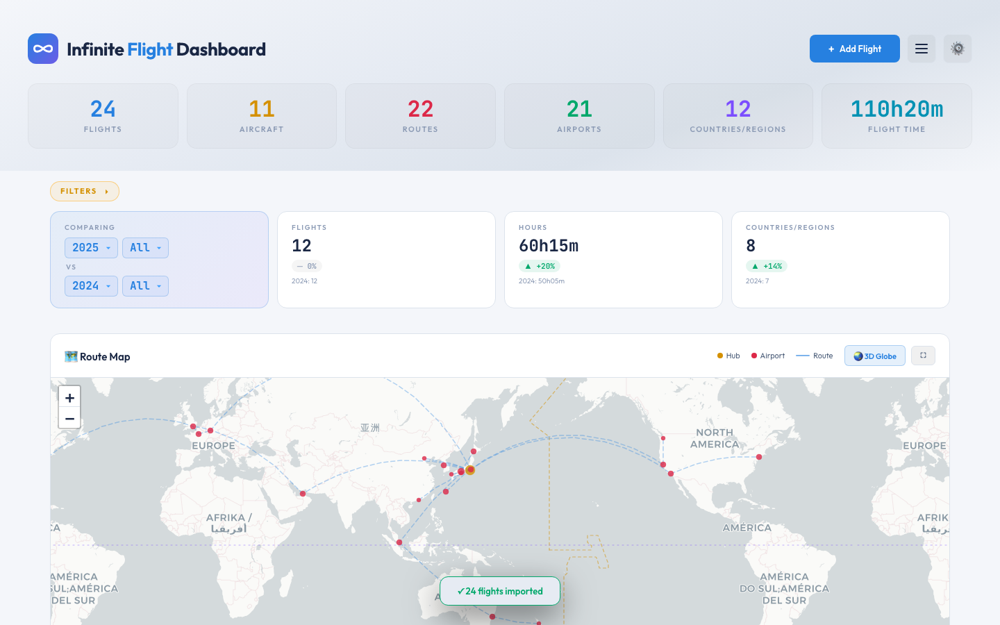
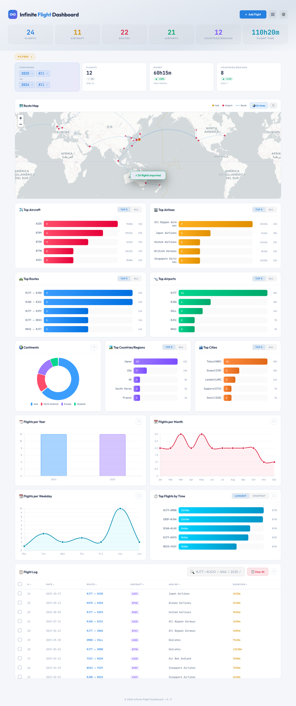
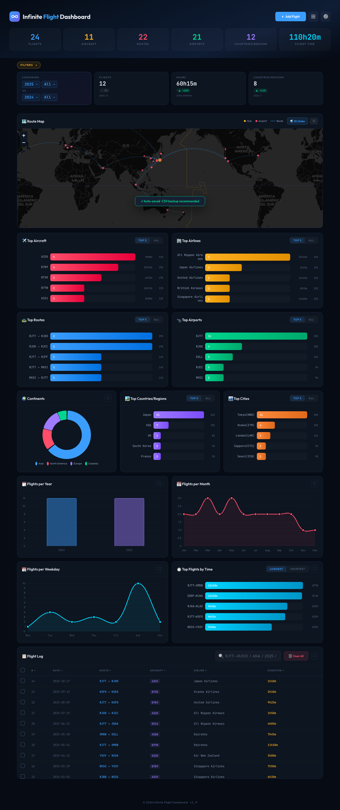
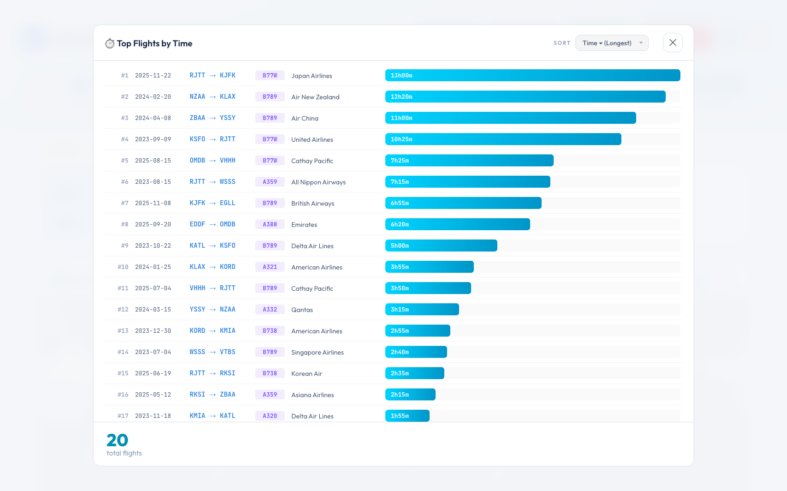
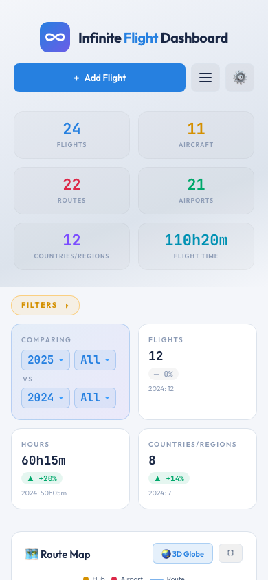
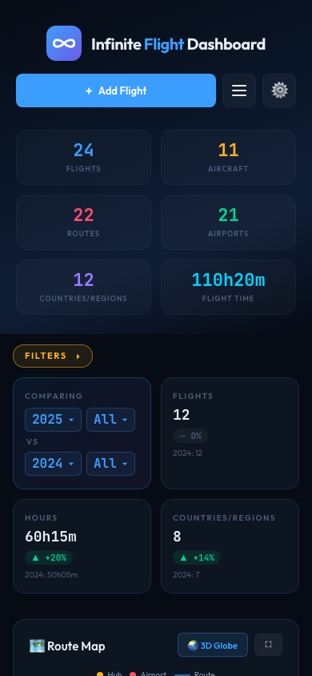

> ## 🆕 A new, rebuilt version is available — please switch
> This page is the **old version (vanilla JS) and is no longer maintained** — it's kept online for now, but there will be **no more updates or bug fixes**.
> 👉 **New version (React): [github.com/AKI-12138/Infinite-Flight-Dashboard](https://github.com/AKI-12138/Infinite-Flight-Dashboard)**

---

<div align="center">

# ✈️ Infinite Flight Dashboard

**A beautiful flight log dashboard for [Infinite Flight](https://infiniteflight.com) pilots.**

### → [**Open the Dashboard**](https://aki-12138.github.io/Infinite-Flight-Dashboard-old_ver/) ←

`aki-12138.github.io/Infinite-Flight-Dashboard`

[English](README.md) · [日本語](README.ja.md) · [简体中文](README.zh-CN.md) · [Changelog](CHANGELOG.md) · [Report a bug](https://github.com/AKI-12138/Infinite-Flight-Dashboard/issues)



</div>

---

## What it is

A simple dashboard that turns your Infinite Flight history into beautiful charts, a route map, and a 3D globe. 

Built for IF pilots who want to actually *see* their journey: which aircraft they fly most, which routes they've covered, how their flight time has grown over the years.

| Light mode | Dark mode |
|---|---|
|  |  |

## What you can do

- **See your stats at a glance** — total flights, hours, aircraft used, countries visited, all up top
- **Beautiful charts for everything** — your top aircraft, top airlines, top routes, top airports, top countries; plus flights per year, per month, per weekday
- **A world map of your routes** — every flight drawn as a great-circle line, your hubs and airports marked
- **Spin your routes on a 3D globe** — auto-rotating; drag to inspect from any angle, or pause the spin
- **Powerful filtering** — a quick bar for the essentials (year, month, airline, aircraft, country, scope) plus an **⚙ Advanced filters** panel for everything else: departure / arrival airports, cities, countries and continents, within-vs-across-continent, and flight duration (buckets or a custom range) — with searchable menus, one-click **presets**, and your own **saveable presets**. Or just click any chart bar to drill in. Built-in year-over-year comparison shows how your flying has grown
- **Easy import** — paste your flight log in almost any format. The dashboard figures out dates, aircraft codes, and airline names automatically
- **190 airports built-in** — major airports worldwide come pre-loaded; add custom ones if you fly somewhere unusual
- **Data check** — see which airports or aircraft in your log aren't recognized (those quietly drop off the map and out of the country counts), add any missing airport in one click, and look up whether any airport is in the dataset
- **Quick search** — find specific flights instantly with simple queries like `RJTT→KJFK B77W 2025`
- **Light and dark themes** — pick one, or let it follow your phone's setting
- **Works on phones** — same dashboard, mobile-friendly layout
- **Just open the link and use it** — no install, no signup, nothing to set up



## How to start using it

Just open this link in any modern browser:

**→ [aki-12138.github.io/Infinite-Flight-Dashboard](https://aki-12138.github.io/Infinite-Flight-Dashboard/)**

That's it. The first time you open it, you'll see an empty dashboard with two buttons — **Import CSV** (if you already have a flight log) or **Add your first flight** (start fresh). The rest of this guide explains everything you can do once you're in.

> 💡 **Tip:** On mobile, you can "Add to Home Screen" from your browser's share menu to make the dashboard feel like an app.

## How to use

### The header

The header keeps just one primary button plus two compact menus:

- **+ Add Flight** — the main action, always visible
- **≡ menu** — Search flights · Data check · Import · Export · Clear all
- **⚙️ settings** — theme (Auto / Light / Dark) and a Status section (auto-save + data check)

### Importing flights from CSV

Open the **≡ menu → 📥 Import** (header) or click **📂 Import CSV** (empty state), then either select a file or paste the CSV directly.

**Required format (6 columns):**

```
date,dep,arr,aircraft,airline,duration
2025-06-01,RJTT,RJOO,B772,ANA,1h15m
2025/6/2,rjoo,rjtt,a359,Japan Airlines,1:10
25-06-03,RJTT,RJCC,b77w,ANA,90m
```

**The importer is lenient.** It handles:
- Date variants: `2025-06-01`, `2025/6/1`, `25-06-01`, `20250601`
- Time variants: `1h15m`, `1:30`, `90m`, `1h30`, `1.5h`
- Aircraft codes: `B772`, `b772`, `B-772`, `Boeing 777-200` (cleaned up as best as possible)
- Airline names: `ANA`, `All Nippon Airways`, `Japan Airlines`, `JAL`
- Separators: comma (`,`), Japanese comma (`、`), tab
- Comments: lines starting with `#` are ignored
- Duplicates: same date + route + aircraft + airline + time are removed automatically

If a row fails to parse, the importer shows you exactly which line and why.

### Adding a single flight

Click **+ Add Flight** (header) or **+ Add your first flight** (empty state). Fill in:

| Field | Example | Notes |
|---|---|---|
| Date | `2025-06-01` | Picker enforces format |
| Flight Time | `1` h `15` m | Use the two number inputs |
| Departure (ICAO) | `RJTT` | 4-letter ICAO code |
| Arrival (ICAO) | `RJOO` | 4-letter ICAO code |
| Aircraft | `B772` | ICAO type code |
| Airline | `ANA` | IATA code or full name; auto-normalized |

Click **Add Flight** to save.

### Adding a custom airport

The app ships with **190 airports** built-in (major hubs worldwide). If you fly to a minor or military field that's not recognized, you'll see "Unknown airport" markers on the map. To fix that, add the airport manually.

**The easy way (one airport):** open the **≡ menu → 🩺 Data check**, find the unrecognized airport in the list, and click **+ Add**. A small form opens with the ICAO code already filled in — enter the coordinates, city, country, and continent, then save. There's a link right in the form to look the coordinates up.

**The bulk way (many airports, via CSV):**
1. Open the **≡ menu → 📥 Import**, then switch to the **🛩 Airports** tab
2. Paste a CSV row in this format:

```
icao,lat,lng,city,country,continent
RJBE,34.6328,135.2239,Kobe,Japan,Asia
```

**Field reference:**

| Field | Format | Example |
|---|---|---|
| `icao` | 4-letter ICAO code | `RJBE` |
| `lat` | Decimal degrees (−90 to +90) | `34.6328` |
| `lng` | Decimal degrees (−180 to +180) | `135.2239` |
| `city` | Display name | `Kobe` |
| `country` | English country name | `Japan` |
| `continent` | One of: `Asia`, `Europe`, `Africa`, `North America`, `South America`, `Oceania`, `Antarctica` | `Asia` |

Custom airports are saved alongside your flights and export with them in the airports CSV.

### How to find latitude and longitude

You need **decimal degrees** (DD), not degrees-minutes-seconds (DMS). 4-6 decimal places is plenty for map display.

| Source | How |
|---|---|
| **Wikipedia** | Search the airport name → look at the right-side infobox → "Coordinates" line. If you see `35°33'08"N`, use the **decimal** form right next to it (`35.5523°N 139.7798°E` → `35.5523,139.7798`). |
| **Google Maps** | Search the airport → right-click on it → click the coordinates at the top of the menu to copy. |
| **OurAirports.com** | Search for the ICAO → coordinates shown near the top of the page. |
| **AirNav.com** | [airnav.com/airports](https://airnav.com/airports) → search by ICAO. |

**Notes:**
- **Sign matters.** Southern hemisphere lat is negative (Sydney `-33.9461`). Western hemisphere lng is negative (JFK `-73.7789`).
- **Strip all symbols.** No `°`, no `N`/`S`/`E`/`W`. Just digits and a minus sign.
- **Decimal, not DMS.** `35°33'08"N` won't work; convert it to `35.5523` first.

**Worked example (Kobe Airport, RJBE):**

| Source data | What to enter |
|---|---|
| `34°37′58″N 135°13′26″E` (DMS) | ❌ Doesn't work |
| `34.6328° N, 135.2239° E` (DD with symbols) | ❌ Doesn't work |
| `34.6328, 135.2239` | ✅ This is what you want |

### Data check

Open the **≡ menu → 🩺 Data check** to see anything in your log the app doesn't recognize:

- **Unrecognized airports** — codes with no coordinates, so they're missing from the map and left out of the Domestic / International and country counts. Each one has a **+ Add** button to add it on the spot (see [Adding a custom airport](#adding-a-custom-airport) above).
- **Unrecognized aircraft** — type codes the app doesn't know (they still count, just without grouping).
- **Check an airport** — type any ICAO / IATA / city name to see whether it's in the dataset.

The **⚙️ settings menu** also shows a quick status — ✓ *all recognized* or ⚠️ *N unrecognized* — that opens this window.

### Search

The Flight Log has a search box at the top. **The simple way:** type any keyword (an airline name, an aircraft type, a year) and it filters. **The fancy way:** combine multiple terms separated by spaces, and they all have to match.

| Pattern | What it does | Example |
|---|---|---|
| `RJTT→RJOO` | Route filter (departure → arrival) | Tokyo to Osaka flights |
| `RJTT->RJOO` | Same — `->`, `→`, `>`, `-` all work as the arrow | |
| `RJTT` | Any flight involving this airport | All Haneda flights |
| `JFK` | IATA codes auto-resolve to ICAO | Same as `KJFK` |
| `ANA` | Airline name or code | All ANA flights |
| `B789` | Aircraft type | All 787-9 flights |
| `2025` | Year | 2025 flights |
| `2025-06` | Year-month | June 2025 |
| `-RJOO` | Exclusion (prefix `-`) | Exclude flights involving Osaka |
| Combine | Space-separated tokens AND together | `RJTT→KJFK B77W 2025` |

**Example: "All my Tokyo–New York B77W flights from 2025, but not the ones to Newark":**

```
RJTT→KJFK B77W 2025 -KEWR
```

### Filters

Filtering has two layers that work together.

**The quick bar** — click **FILTERS ▾** to open it. Six multi-select chips:

- 🗓 **Year** · 📅 **Month** · 🏢 **Airline** · ✈️ **Aircraft** · 🏞 **Country/Region** · 🌐 **Scope** (All / Domestic / International)

**⚙ Advanced filters** — the **⚙ More** button (right of the bar) opens a panel with the full set, grouped by category:

- **Airport / City / Country / Continent** — each filterable by **departure**, **arrival**, or **either**
- **Continental scope** — within a single continent vs across continents
- **Flight duration** — pick buckets (under 1h · 1–3h · 3–6h · 6–10h · 10h+) or type a **custom hour range**
- …plus Date (Year / Month / Weekday) and Aircraft / Airline, so everything lives in one place

Handy touches in the panel:

- **Search** — long menus (airports, cities, countries…) have a search box; type a code *or an airport name* ("haneda", "tokyo") to find it fast
- **Smart options** — pick a continent or country and the airport / city / country lists narrow to match, so you're not scrolling past irrelevant options
- **Presets** — one-click combinations like *Inter-continental long-haul*, *Weekend international*, *Domestic short hops*
- **Saved presets** — set up any combination and **💾 Save preset** it with a name; it appears under **Saved** and is remembered on your device (edit / delete anytime)

The dashboard updates live as you select. The **Comparing** card shows year-over-year deltas based on your current Year selection. The filter bar stays pinned to the top as you scroll.

**Tip — click to filter:** open any card's expanded view and click a bar or point to filter the whole dashboard to it, then click the same one again to clear. Works on **Flights per Year / Month / Weekday** and **Top Aircraft / Airlines / Countries / Routes / Airports / Cities**.

### Theme switching

Open the **⚙️ settings menu** (header, top-right) and pick a theme:

| Mode | Icon | Behavior |
|---|---|---|
| Auto | 🔄 | Follows your OS preference, live-updates when OS theme changes |
| Light | ☀️ | Forces light |
| Dark | 🌙 | Forces dark |

Your choice persists across sessions.

| Mobile — light | Mobile — dark |
|---|---|
|  |  |

## Data & Privacy

- **100% local.** Your flights are stored in your browser's `localStorage`. There is no server, no analytics, no cookies, no third-party calls (other than CDN font/library loads).
- **No account.** No sign-up, no login.
- **Easy backup.** Open the **≡ menu → 📤 Export** anytime to download a CSV of your flights (and optionally your custom airports).
- **Easy migration.** Drop your exported CSV on a new device → **Import** → done.
- **Easy wipe.** Open the **≡ menu → 🗑 Clear all** to delete everything, with a confirmation dialog.

If you ever want to know "is my data really saved here?", open the **⚙️ settings menu** — the **Status** section tells you the current storage state (and flags any unrecognized data).

## Works on

Pretty much any modern browser, on desktop or mobile:

- 💻 Chrome, Safari, Firefox, Edge on Windows / Mac / Linux
- 📱 iPhone (Safari, Chrome), Android (Chrome, Samsung Internet)

If something doesn't look right, try updating your browser to the latest version.

## About this project

This is a **personal hobby project**, built by one Infinite Flight enthusiast and shared with the IF community to enjoy.

- **No guarantee of ongoing maintenance or support.** Updates may be sporadic — or stop entirely.
- **Things may change.** Features, UI, data format, even the URL itself could shift in future versions without notice.
- **Use it freely, but don't depend on it for anything critical.** If your flight history matters to you, keep a CSV backup.

That said, if you find a bug, [open an issue](https://github.com/AKI-12138/Infinite-Flight-Dashboard/issues) and I'll look at it when I get the time. No promises on when, but I do read them.

See [**CHANGELOG.md**](CHANGELOG.md) for what's new in each version.

**One more thing worth knowing:** most of this code was written with the help of AI coding assistants (mainly Claude), under my direction and design choices. I'm not a JavaScript developer — this project exists because AI tools have made it possible for non-coders to ship polished software. If you find weird patterns in the code, it's probably either AI quirks or my unclear instructions (hard to tell which 😅).

## For developers

If you're a developer curious about how this is built, the code is all here in this repository — it's a static site (HTML / CSS / JavaScript) with no build step. A proper developer guide may come later.

## Credits

Built by [AKI-12138](https://github.com/AKI-12138) for the Infinite Flight community.

Inspired by every IF pilot who's ever wondered "wait, how many hours have I actually flown?".

Made possible by these wonderful open-source projects: [Leaflet](https://leafletjs.com/) (2D map), [Chart.js](https://www.chartjs.org/) (charts), [Globe.gl](https://globe.gl/) (3D globe), [Natural Earth](https://www.naturalearthdata.com/) (country borders), and the [Outfit](https://fonts.google.com/specimen/Outfit) and [JetBrains Mono](https://www.jetbrains.com/lp/mono/) fonts. Thank you to all the maintainers.

## License

**TBD.** Until a license is added, default copyright applies — you can read and view the code, but please don't redistribute or use it commercially without asking first.

---

<div align="center">

*Not affiliated with or endorsed by Infinite Flight LLC.*

</div>
